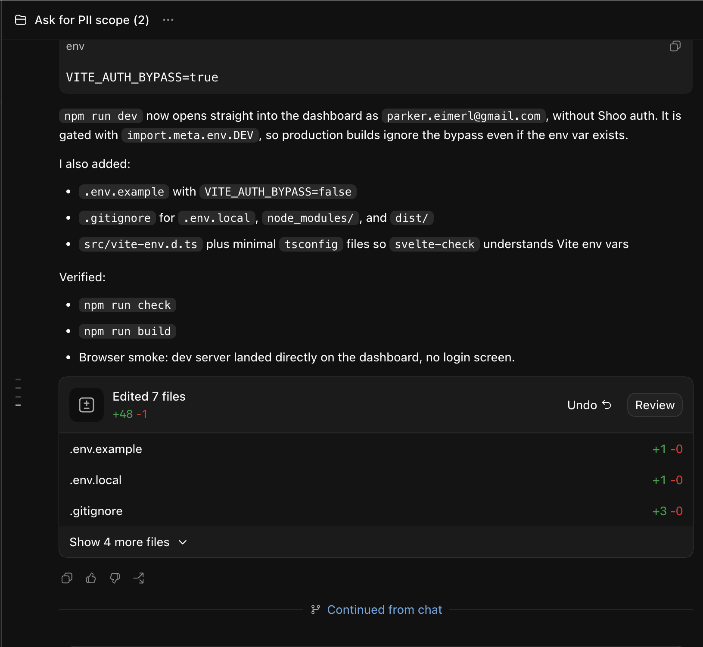

# T3 Agent product architecture

This is the authoritative living design for T3 Agent. The documents under `docs/research/` preserve the evidence and alternatives that led here; where an older research recommendation conflicts with this document, this document wins.

## Product boundary

T3 Agent is a Hermes-native gateway and conversation surface. Hermes is already running and independently managed. The first deployment runs the T3 server and Hermes on the same Linux machine, with authenticated loopback communication between them.

T3 Agent does not launch an ACP agent, wrap the Hermes CLI, or own the Hermes process lifecycle. It exposes only Hermes initially while keeping T3 Code's provider architecture reusable. Projects, repositories, worktrees, branches, and working-directory selection are compatibility infrastructure, not initial T3 Agent concepts.

The product first targets web/desktop use. Tailscale is a valid development and private-access path. An operator-owned T3 Connect deployment and push delivery come after the local interaction surface is complete.

## Current foundation

The local gateway foundation is implemented:

- a Hermes `t3agent` platform plugin and authenticated loopback protocol;
- a T3 Hermes provider driver that attaches to the running gateway;
- one Hermes conversation per created T3 Agent thread;
- streaming replies, turn completion, interruption, and restart/reconnect recovery;
- Hermes approvals, clarifications, and slash confirmations;
- command discovery from Hermes's command, skill, and plugin registries;
- inbound and outbound image attachments;
- proactive and background delivery into T3 threads;
- a web product mode that presents flat conversations and hides most coding controls.

The compatibility project still exists internally because T3's persistence model requires a project identifier. Product clients must hide it rather than teaching users that a Hermes conversation belongs to a repository.

## Conversation identity

A T3 Agent thread is backed by one Hermes session. New conversations create new Hermes sessions; a fork creates a new T3 thread and a child Hermes session. T3's stored transcript is the visible projection, while Hermes's session database remains the authoritative agent context.

The interface must never silently switch the Hermes session underneath an existing T3 transcript. Lifecycle commands therefore require T3-native navigation semantics rather than unconditional command passthrough.

### Forking

Every completed agent run exposes a fork icon beside its copy and timestamp controls. Activating it:

1. copies Hermes history through that completed run;
2. creates a child Hermes session;
3. creates and binds a new T3 Agent thread;
4. assigns an automatic fork title;
5. navigates to the new thread; and
6. leaves the original thread and session usable.

There is no naming dialog. The normal thread rename control handles naming afterward. `/fork` invokes the same primitive at the latest completed run. It must not invoke Hermes's existing gateway `/branch` behavior, which switches the session behind the current chat.

The cut point is a completed agent-run boundary. Tool events and partial assistant segments within a run are not independently forkable.

### Session browser and resume

Lifecycle navigation must never make a visible transcript disagree with Hermes context:

- `/new` creates and opens a new T3 Agent thread.
- `/sessions` and `/resume` open a browser containing both T3 Agent and cross-gateway Hermes sessions.
- The browser separates T3 Agent sessions from sessions originating in Discord, the CLI, or another gateway with restrained grouping and origin metadata rather than prominent mode controls.
- Selecting a T3 Agent session navigates to its existing thread instead of creating a duplicate.
- Selecting a cross-gateway session that has not been imported immediately copies its history into a child Hermes session, creates a T3 Agent thread bound to that child, and opens it. There is no intermediate preview or confirmation.
- Selecting a cross-gateway session that has already been imported opens the existing T3 Agent copy. A quiet secondary action offers “Import another copy” when a separate branch is actually wanted; the common resume path does not show a modal.

T3 Agent does not attach an additional gateway to the same live cross-gateway session. The child-copy boundary prevents concurrent gateways from silently steering one context and makes the T3 transcript's session identity unambiguous.

### Thread lineage

Imported and forked threads preserve their origin as thread lineage. At the boundary between inherited history and new T3 Agent messages, the timeline shows a quiet divider modeled after Codex's “Continued from chat” treatment:

- an imported conversation says “Imported from Discord” or names its other provider directly;
- a forked T3 Agent conversation says “Continued from [source thread]”; and
- when the source is another T3 Agent thread, the marker links back to it.

The marker is lighter than ordinary message content and does not become a persistent banner or composer control. External sources may also be linked when Hermes provides a stable address that T3 Agent can safely open. If the source has been deleted or becomes inaccessible, the marker remains as non-clickable provenance.

Visual reference—not an exact styling requirement ([source capture](https://imgur.com/a/YJWldED)):

## Commands

Hermes remains the source of truth for available commands, aliases, skills, plugin commands, and argument hints. T3 Agent supplies searchable `/` completion and normally forwards submitted text unchanged.

After a command is selected or recognized, the composer may show its remaining `args_hint` as gray ghost text. The hint is not part of the draft and is never submitted. Typing an argument consumes or advances the hint. This is lightweight argument assistance, not an embedded command form.

Lifecycle commands are the deliberate exception to passthrough because their presentation changes T3 thread identity.

## Model and reasoning controls

The composer shows the effective Hermes model as product context. The reasoning selector is the primary control and should retain the compact, polished treatment already familiar from T3 Code rather than being buried in settings or subordinated to provider selection.

Reasoning is a Hermes-native per-thread selector. It shows `Default` for inherited configuration and the levels supported by Hermes: `none`, `minimal`, `low`, `medium`, `high`, `xhigh`, `max`, and `ultra`. A selection changes the current Hermes session, not the global Hermes configuration.

The model selector queries Hermes's authenticated provider/model inventory and exposes every model Hermes reports, grouped by provider. It applies a per-session model override; T3 Agent does not maintain a curated allowlist. Expensive-model confirmations and provider-specific validation remain Hermes-owned.

The existing T3 Code picker already provides fuzzy model search across model and provider fields, provider navigation, favorites, virtualization, and keyboard selection. T3 Agent should retain that behavior while feeding it Hermes's inventory.

New threads begin with Hermes's configured model and reasoning defaults, never the last values selected in another thread. A later user preference may override those initial defaults explicitly.

Changing the active model or reasoning effort adds a quiet session-setting event to the timeline, such as “Reasoning changed to High.” It is metadata rather than a user or assistant message and applies to subsequent turns.

## Approvals and clarifications

Approvals, denials, clarifications, and slash confirmations are core gateway behavior. The current bridge resolves them end to end.

The preferred presentation is an inline card at the point where Hermes paused plus a compact pending-action indicator near the composer while the request remains unresolved. Activating the indicator returns the user to the inline card. Approval polish is lower priority than reasoning, forking, command hints, and voice notes.

## Voice notes

Voice-note input and outbound TTS are separate capabilities. T3 Agent records, uploads, plays, and delivers voice notes; it does not transcribe them. Hermes owns STT configuration, provider selection, transcription, and the text ultimately given to the agent.

The web recording bar includes:

- elapsed time;
- a live metering waveform;
- pause and resume;
- cancel;
- stop; and
- send.

Stop ends capture and enters a voice-draft state where the recording can be replayed, discarded, or sent. Send while capture is active finalizes and submits the recording immediately without requiring the preview step.

Web recording uses the browser's supported `MediaRecorder` output, preferring WebM/Opus and accepting MP4/AAC where required. Native mobile recording uses M4A/AAC. Hermes already accepts these formats for transcription, so T3 Agent should preserve the real MIME type instead of transcoding everything to OGG. T3 Agent imposes no arbitrary voice-duration limit.

The installed Hermes STT path has a real 25 MiB per-file ceiling and no duration ceiling. The current T3 plugin has a lower 16 MiB whole-request ceiling because it was designed for text and images. Voice transport must be extended deliberately—preferably without base64 expansion—to reach Hermes's actual limit rather than introducing an unrelated product timer.

The sent message appears immediately as a playable voice bubble. Hermes currently transcribes eligible audio before the agent turn and, when transcript echoing is enabled, sends the successful transcript back through the platform adapter as an ordinary outbound message. T3 Agent must not manufacture transcription progress, failure, or retry states that Hermes did not emit.

For the richer presentation, the Hermes integration should tag that existing transcript echo with a semantic transcript kind and source voice-message identity. T3 then renders the Hermes-produced text beneath the matching bubble: short transcripts expanded by default and long transcripts collapsed. This is bridge metadata around Hermes's transcription result, not a T3 transcription pipeline. Until Hermes exposes that semantic result, the echo remains an ordinary Hermes message. Transcripts must never be attached by guessing that the next text message belongs to the recording.

The current Hermes gateway has no transcription-retry primitive and does not send a structured failure event to the platform adapter. V1 therefore has no Retry Transcription control. If Hermes later exposes failure or retry semantics, T3 Agent may render them without taking ownership of STT.

Background recording is required on mobile. It therefore includes the native iOS background-audio mode and Android foreground microphone service/recording notification. Web voice work may ship before the mobile product pass.

See the [Hermes voice-note flow research](../research/hermes-voice-note-flow.md) for the pinned source behavior, accepted formats, and bridge gaps.

## Background work, cron, and notifications

V1 background support is command-level gateway parity: `/background`, `/agents`, queue/steer behavior, and result delivery. A dedicated background-agent visualizer can be inherited from T3 Code later.

Hermes cron execution and delivery are distinct. Each scheduled run uses a fresh isolated cron execution session; its result may be delivered into an originating, dedicated, or newly created T3 Agent thread. T3 Agent does not implement a second scheduler.

Push notifications and T3 Connect follow the local interaction surface. A direct Tailscale or browser connection cannot by itself wake a suspended mobile app.

Notification policy is biased toward delivery. Ordinary turns, background agents, and cron completions may notify whenever the app is backgrounded, disconnected, or its foreground state is uncertain. Notifications are suppressed when the client reliably reports that the app is actively foregrounded; uncertainty should produce a notification rather than silently losing a completion.

## Branding and shell

Hermes uses its real brand asset rather than the Pi provider icon. Small provider placements should prefer Hermes's monochrome glyph; larger app placements may use the full app artwork.

T3 Code's development, nightly, and alpha sidebar artwork is stage-specific upstream branding. Its presence or absence is independent of Hermes connectivity and is not a T3 Agent feature requirement.

The native mobile app in this fork becomes T3 Agent directly: rename and adapt the existing app, its identifiers, assets, copy, permissions, widgets, shortcuts, URL scheme, and notification branding. The fork does not maintain a parallel T3 Code product mode. Unmodified T3 Code mobile development remains in the upstream/main T3 Code repository.

## Delivery plan

See [the T3 Agent roadmap](../project/t3-agent-roadmap.md) for the phased implementation backlog.
